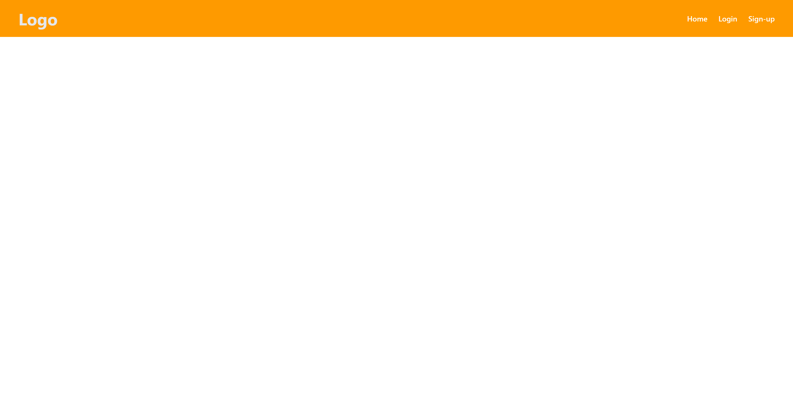
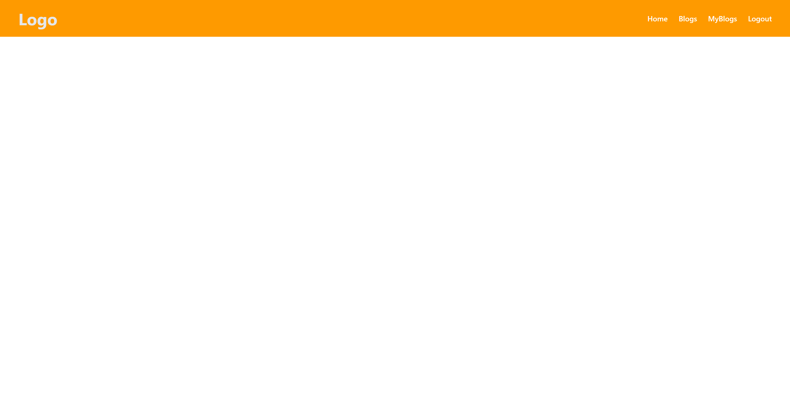
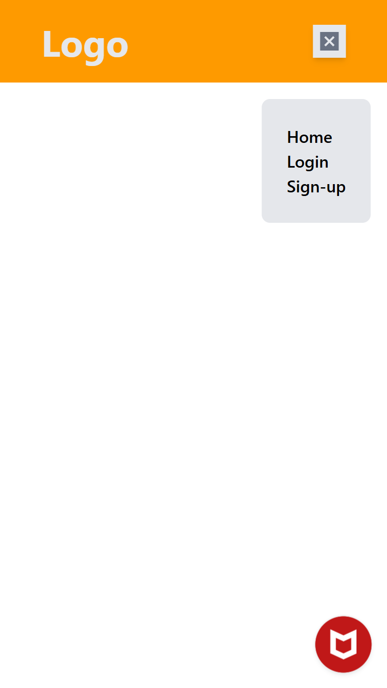
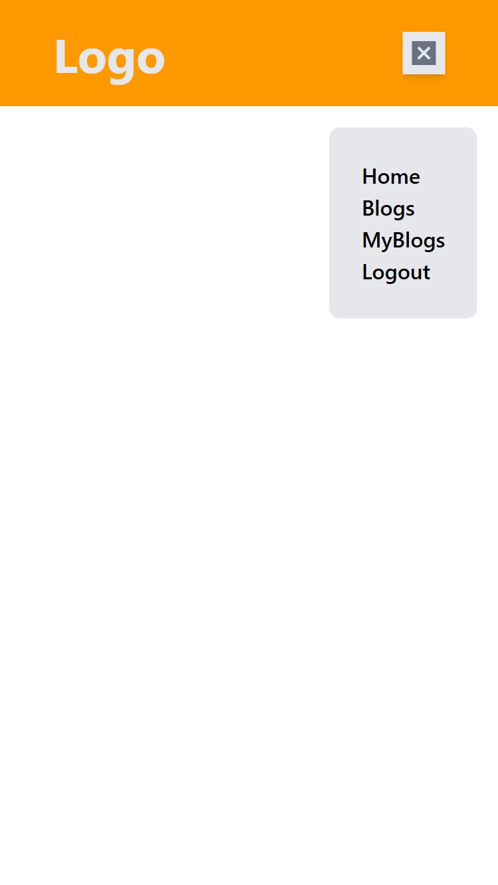

# React Navbar with AuthContext

This project is a responsive React Navbar component built with the Context API to manage user authentication state. The styling is handled using Tailwind CSS for a clean and modern UI.

## 🚀 Features

- 🔐 Authentication Context (`AuthContext`) using `useContext` and `useState`
- 📱 Responsive design using Tailwind CSS
- 🧠 Global state management without external libraries
- 🔁 Login and Logout button toggle based on authentication state
- 🎯 Reusable and scalable structure

## 🛠️ Tech Stack

- [React](https://reactjs.org/)
- [Context API](https://reactjs.org/docs/context.html)
- [Tailwind CSS](https://tailwindcss.com/)
- [Material UI](https://mui.com/material-ui/material-icons/)(for adding icons)

## Screenshots

- Large Screen
  

  

- Small Screen
  

  

  

## Demo Link

[live Demo](https://react-contextapi-p09.netlify.app/)
